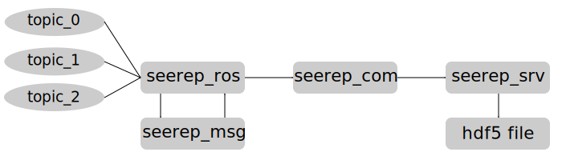

# seerep 
seerep stands for SEmantic Environment REPresentation and represents a system that efficiently implements communication and storage layers for sensor and environmental data.

In the current version, ROS (Robot Operating System) messages of configured topics are converted to Protobuf and transmitted to a server using grpc.
The server stores the received data in an HDF5 file. The data can later be accessed efficiently enabling goal-oriented access to specific datasets and data ranges.



## Quick Start

For the impatient people, we set up a docker images with all requirements and dependencies already set up. 
1. Clone seerep-docker at https://github.com/agri-gaia/seerep-docker
2. Inside seerep-docker run the createContainer.sh script to pull the latest container
3. Start by running the run.sh
4. Happy coding!

## Installation

In case you want to install seerep on your system, the following presents guidance.

### Dependencies

First, you will need the dependencies. 
- ProtoBuf
- gRPC
- HighFive 

Therefore, please follow along the script: https://github.com/agri-gaia/seerep-docker/blob/main/Docker/installDependencies.sh 

### Build seerep

We provide two ways to build seerep: First, manuel to the system with cmake and make, and second, with catkin build.

#### Catkin Build
```
source /opt/ros/melodic/setup.bash
mkdir -p seerep_ws/src
cd seerep_ws/src
git clone git@github.com:agri-gaia/seerep.git
catkin_init_workspace
cd ..
catkin build
```

#### System Installation

Clone the repo: `git clone git@github.com:agri-gaia/seerep.git` 

First, the messages (`seerep-msg`) have to be compiled as they are used as basis for all communications.

```
cd seerep/seerep-msgs
mkdir build
cd build
cmake ..
make
```

In the next step we will install the generated protobuf message C++ header files (`*.pb.h?`) and protbuf files (`*.proto`), as well as the built library (`libseerepmsgs.a`) to the system.
In addition, the package will install a package configuration file (`SeerepMsgsConfig.cmake`) for cmake. This file will point to all the necessary resources to be found by the other cmake projects. Also, a cmake version file (`SeerepMsgsConfigVersion.cmake`) will be installed to control the versioning. To check the correct version and definitions in C++, a separate header file (`SeerepMsgsConfig.h`) is also installed.

In conclusion the following files will be installed to the system:

- `*.proto`, message definitions in the folder protos
- `*.pb.h`, thegenerated header files
- `libseerepmsgs.a` the corresponding library
- `SeerepMsgsConfig.cmake` CMake package file
- `SeerepMsgsConfigVersion.cmake` Cmake package version file
- `SeerepMsgsConfig.h` C++ generated version and definition header

```
sudo make install
```

To build the communication interfaces (`seerep-com`), i.e., the grpc servie interfaces which communicate data from a grpc client to a server and vice versa, we will build the seerep-com package.
```
cd seerep-com
mkdir build
cd build
cmake ..
make
```
As above, the package will install several files to the system.

- `*.pb.h` and `*.grpc.pb.h`
- `libseerepcom.a` the corresponding library
- `SeerepComConfig.cmake` CMake package file
- `SeerepComConfigVersion.cmake` Cmake package version file
- `SeerepComConfig.h` C++ generated version and definition header
```
sudo make install
```


