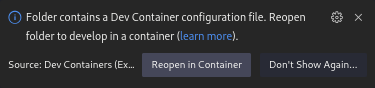

# Development Setup

For the development of SEEREP, a [Visual Studio Code Dev Container](https://code.visualstudio.com/docs
/devcontainers/containers) is used. This enables the use of a Docker container as a development environment,
handling dependencies in a unified manner and abstracting different operating systems.
For the system requirements, please refer to the
[Visual Studio Code Docs](https://code.visualstudio.com/docs/devcontainers/containers#_system-requirements).

## Setup

Clone the repository with:

<!-- markdownlint-disable MD046 -->
=== "ssh"

    ```bash
    git clone git@github.com:agri-gaia/seerep.git
    ```

=== "https"

    ```bash
    git clone https://github.com/agri-gaia/seerep
    ```

For the development, it is assumed that the directory designated for SEEREP's data storage is a sibling folder named
`seerep-data`, located next to the repository. **Make sure it exists**!

```bash
mkdir seerep-data
```

!!! warning

    Since a Docker bind mount is used to mount the data storage directory inside the container, providing an
    incorrect or non-existent path for the host directory will result in an unclear error message when
    starting the container.

<!-- markdownlint-enable MD046 -->

Subsequently, install the [Remote Containers](https://marketplace.visualstudio.com/
items?itemName=ms-vscode-remote.remote-containers) and [Docker](https://marketplace.visualstudio.com/
items?itemName=ms-azuretools.vscode-docker) Visual Studio Code extensions:

```bash
code --install-extension ms-vscode-remote.remote-containers ; \
code --install-extension ms-azuretools.vscode-docker
```

Launch Visual Studio Code within the repository:

```bash
code seerep
```

The presence of a `.devcontainer` folder should automatically trigger the detection of a Dev-Container environment.
To reopen the repository folder in the container, a prompt will appear on the lower right corner:

<figure markdown>
  
  <figcaption> Reopen in Dev-Container menu </figcaption>
</figure>

Or in case this window doesn't open, use either ++f1++ or ++ctrl+shift+p++ and input
`Remote-Containers: Reopen Folder in Container`. Confirm by pressing ++enter++.

Starting the Dev-Container the first time may take a while as it involves downloading the required
[SEEREP Docker image](https://github.com/agri-gaia/seerep/pkgs/container/seerep_base) (around 4 GB).
Additionally Visual Studio Code extensions, Intellisense, and pre-commit checks are setup in the container.

## Container Credentials

The default credentials have both the username and password set to `docker`.

## Pre Commit Checks

The repository uses pre-commit hooks to verify compliance with established coding guidelines and,
if necessary, to format the code in a consistent way. The checks are automatically run before each commit and
as part of the GitHub CI. To manually run the checks use:

```bash
pre-commit run -a
```

The main hooks are:

- [Clang-Format 15](https://clang.llvm.org/docs/ClangFormat.html) for C/C++
- [Ruff](https://docs.astral.sh/ruff/) for Python
- [Markdownlint](https://github.com/igorshubovych/markdownlint-cli) for Markdown

Along with other checks for Dockerfiles and YAML, see the complete list in the
[configuration](https://github.com/agri-gaia/seerep/blob/main/.pre-commit-config.yaml).
