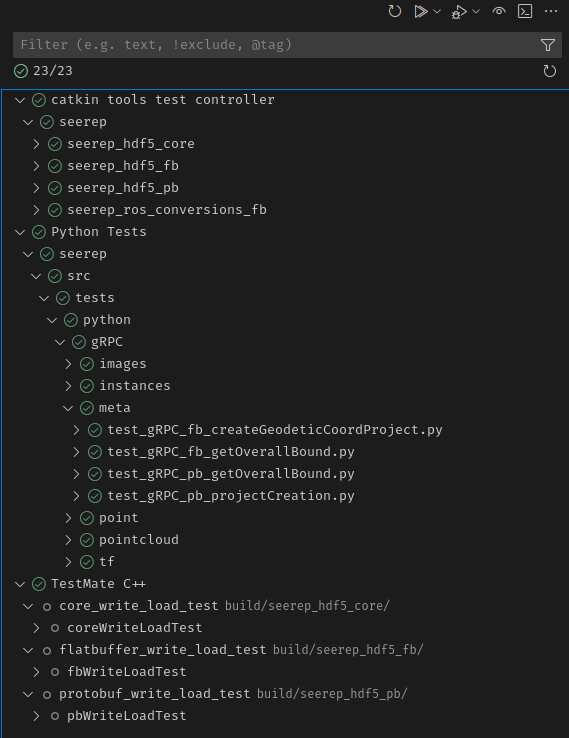

# Tests

SEEREP uses [GoogleTest](https://github.com/google/googletest) for C++ Unit Tests and
[pytest](https://github.com/pytest-dev/pytest) for integration tests.
Unit tests are placed into the individual ROS packages while the intregation tests are setup in the `/tests` directory.
The tests run automatically as a GitHub Action with every push.

## C++ Unit Tests

Currently tests are set up for:

- [Flatbuffer ROS Conversions](https://github.com/agri-gaia/seerep/blob/main/seerep_ros/seerep_ros_conversions_fb/test/ros_to_fb_conversion_test.cpp):
    Functions for converting ROS message to Flatbuffers message and vice versa.
- [HDF5 PB Image Interface](https://github.com/agri-gaia/seerep/blob/main/seerep_hdf5/seerep_hdf5_pb/test/pb_write_load_test.cpp)
    : Reading and writing of ProtoBuf Image messages to HDF5.
- [HDF5 FB Image Interface](https://github.com/agri-gaia/seerep/blob/main/seerep_hdf5/seerep_hdf5_fb/test/fb_write_load_test.cpp)
    : Reading and writing of Flatbuffer Image messages to HDF5.

### Using catkin

To run the tests with `catkin` use:

```shell
catkin test # run all availabe tests
catkin test <specific-package> # test a specific package
```

## Python Integration Tests

The integration tests cover most of the send and receive operations of SEEREP via Python.
They use the [Python examples](https://github.com/agri-gaia/seerep/tree/main/examples/python/gRPC) as a base.

### Using pytest

To run all integration tests use:

```shell
pytest
```

in source directory `/seerep/src/`.

To execute a subset of the integration tests:

```shell
# Recursively executes all tests in the meta directory
pytest tests/python/gRPC/meta

# Same execution as above
cd tests/python/gRPC/meta
pytest

# Run all tests specified in this file
pytest tests/python/gRPC/meta/test_gRPC_pb_projectCreation.py

```

## Testing through VSCode

Another way to run the tests is via the VSCode Testing Tab (:octicons-beaker-24: icon)

If you have a fresh installation of the project, it
can happen, that the test cases won't be recognized.
In order to fix that, use the reload icon :octicons-sync-16: in the top menu



To run the tests use the play icon :material-play-outline: at the top.
