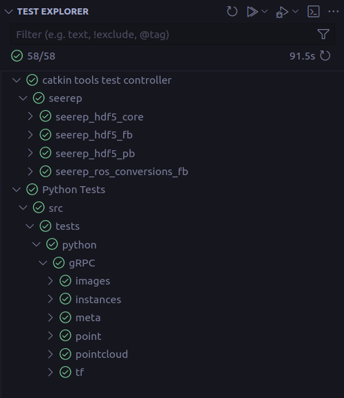

# Tests

SEEREP uses [GoogleTest](https://github.com/google/googletest) for C++ Unit Tests
and [pytest](https://github.com/pytest-dev/pytest) for integration tests. Unit
tests are placed into the individual ROS packages while the intregation tests
are setup in the `/test` directory. The tests run automatically as a GitHub
Action with every push.

## C++ Unit Tests

Currently unit tests are set up for:

- [Flatbuffer ROS Conversions](https://github.com/DFKI-NI/seerep/blob/main/seerep_ros/seerep_ros_conversions_fb/test/ros_to_fb_conversion_test.cpp):
    Functions for converting ROS message to Flatbuffers message and vice versa.
- [HDF5 PB Image Interface](https://github.com/DFKI-NI/seerep/blob/main/seerep_hdf5/seerep_hdf5_pb/test/pb_write_load_test.cpp)
    : Reading and writing of Protocol Buffer image messages to HDF5.
- [HDF5 FB Image Interface](https://github.com/DFKI-NI/seerep/blob/main/seerep_hdf5/seerep_hdf5_fb/test/fb_write_load_test.cpp)
    : Reading and writing of Flatbuffer image messages to HDF5.

### Using catkin

To run the tests with `catkin` use:

```shell
catkin test # run all availabe tests
catkin test <specific-package> # run all tests from a specific package
```

## Python Integration Tests

The integration tests, based on the
[Python examples](https://github.com/DFKI-NI/seerep/tree/main/examples/python/gRPC),
cover most of the send and receive operations of SEEREP.

### Using pytest

To run all integration tests use:

```shell
pytest
```

in the main repository directory.

To execute a subset of the integration tests use:

```shell
# Recursively executes all tests in the meta directory
pytest tests/python/gRPC/meta

# Same execution as above
cd tests/python/gRPC/meta
pytest

# Run all tests specified in this file
pytest tests/python/gRPC/meta/test_gRPC_pb_projectCreation.py

```

## Testing through VSCode

Another way to run the tests is through the VSCode Testing Tab
(:octicons-beaker-24: icon)

!!! info
    <!-- markdownlint-disable-next-line -->
    With a fresh installation of the project, the test cases might not be
    recognized. To resolve this, use the :octicons-sync-16: button in the top
    menu to refresh.

To run the tests use the :material-play-outline: button at the top or select
individual test cases to run.

<figure markdown>
  {width="450"}
  <figcaption> Sucessfull run all of tests using the VS-Code test explorer </figcaption>
</figure>
