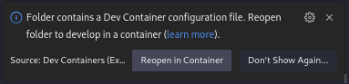

# Development Setup

For the development of SEEREP, we employ a [Visual Studio Code Dev Container](https://code.visualstudio.com/docs
/devcontainers/containers), enabling us to utilize a container as our development environment. This approach abstracts
operating systems, automatically managing dependencies in a unified manner. To review system requirements, kindly refer
to the [system requirements section](https://code.visualstudio.com/docs/devcontainers/containers#_system-requirements).

## Setup

Initially, clone the repository with:

=== "ssh"

    ``` bash
    git clone git@github.com:agri-gaia/seerep.git
    ```

=== "https"

    ``` bash
    git clone https://github.com/agri-gaia/seerep
    ```

For the development, it is presumed that the directory designated for SEEREP's data storage is a sibling folder named
`seerep-data`, positioned adjacent to the repository. **Ensure its existence!**

!!! warning

    As a docker bind mount is employed, providing an incorrect or non-existent path for the host directory will lead
    to an obscure error message upon initiating the container.

Subsequently, install the [Remote Containers](https://marketplace.visualstudio.com/
items?itemName=ms-vscode-remote.remote-containers) and [Docker](https://marketplace.visualstudio.com/
items?itemName=ms-azuretools.vscode-docker) Visual Studio Code extensions:

<!-- markdownlint-disable-next-line MD046 -->
```bash
code --install-extension ms-vscode-remote.remote-containers ; \
code --install-extension ms-azuretools.vscode-docker
```

Launch Visual Studio Code within the repository by executing the following command:

<!-- markdownlint-disable-next-line MD046 -->
```bash
code .
```

The presence of a `.devcontainer` folder should trigger the automatic detection of the Dev-Container environment.
It will prompt whether to reopen the repository in the container, this interaction will be displayed in the
lower right-hand corner.

<figure markdown>
  
  <figcaption> Reopen in Dev-Container menu </figcaption>
</figure>

In case the window doesn't open, use either ++f1++ or ++ctrl+shift+p++ and input
`Remote-Containers: Reopen Folder in Container`. Confirm by pressing ++enter++.

Please be patient during the installation process as it involves downloading the Docker image (approximately 5 GB) and
initializing it. Additionally, the setup includes VS Code extensions, Intellisense, and pre-commit checks within the container.

## Credentials

The default credentials consist of the username and password being set as `docker`.

## Pre Commit Checks

The repository utilizes pre-commit checks to verify compliance with established coding guidelines and,
if necessary, to format the code. These checks are automatically performed before each commit.
To manually run the checks during development, use: `pre-commit run -a`.
