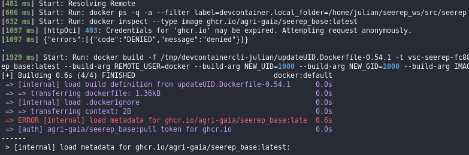

# Known Errors

This page functions as a list of frequently encountered errors during the project development.
Consult it whenever you encounter issues; there's a chance your problem is documented here. If not, consider adding it
once you figure out how to fix it.

## Downloading the Docker Images

SEEREP's Docker Images are hosted on the [GitHub Container Registry](https://github.com/orgs/agri-gaia/
packages?repo_name=seerep). To install or modify any public or private package using GitHub Packages, **authentication**
through a personal access token (classic) **is necessary**. Detailed setup instructions can be found in the
[GitHub Docs](https://docs.github.com/en/packages/working-with-a-github-packages-registry/
working-with-the-container-registry).

<figure markdown>
  {width="600"}
  <figcaption> ghcr.io login error </figcaption>
</figure>

## Unable to Start the Dev-Container

If the setup or the `Remote-Containers: Reopen Folder in Container` operation encounters issues, consider trying the
following steps to resolve the problem:

1. Ensure that the container is not running in the background:

    ```shell
    docker stop $(docker ps | grep seerep | awk '{print $1}')
    ```

2. Consider reinstalling for a clean start. Execute the provided commands to remove all components associated
with the Dev-Container:

    ```shell
    docker rm $(docker container ls -a | grep seerep | awk '{print $1}')
    docker rmi $(docker image ls -a | grep seerep | awk '{print $1}')
    docker volume rm seerep-vscode-extensions vscode
    ```

## Running out of RAM when compiling

Building the main executable, especially with WSL[^1], may demand a significant amount of system memory. If your system
freezes during the build, it may be necessary to restrict the memory usage in catkin. Utilize the commands below to
prevent `catkin` from initiating new jobs once the memory limit is reached. Further details can be found in the
documentation [here](https://catkin-tools.readthedocs.io/en/latest/verbs/catkin_build.html#configuring-memory-use).

```shell
pip install psutil
catkin build --mem-limit 40% # set as a percentage of system memory
catkin build --mem-limit 8G  # set as an absolute memory limit
```

[^1]: Windows Subsystem for Linux: A way to access Linux on a Windows system without using a VM or a dualboot setup.
