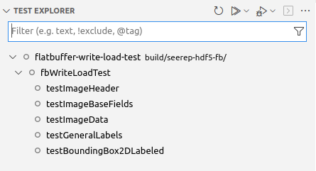

# Testing

We are currently working on integrating more tests into SEEREP.
[GoogleTest](https://github.com/google/googletest) is used as  a testing
framework. The tests are also run in a GitHub workflow for every PR and push to
the main branch, additionally the tests can be run locally in a couple of
different ways.

## Running tests locally

### Catkin

The tests can be run via `catkin` in the command line. When run without a
specific package, all test in the workspace are run. But while this is very
convenient, catkin does not provide much information/output if a test fails.

```bash
catkin test (<specific-package>)
```

### Vs-Code

Another way to run the test is via the Vs-Code test explorer (triangle test-tube on
the left bar of VS-Code). If you have done a fresh installation of the project it
can happen, that the test cases won't be recognized. In order to fix that, just
restart the development container. For that you can use `Reopen Folder Locally`
and then `Reopen In Container`. Now you should be able to see the test cases as,
in the example:

{ width=400}

The icons in the top are mostly self-explanatory, all tests can be run, a single
test can be debugged, and a terminal can be opened to print the output of the tests.

### Executables

If you would like to run the tests via their executables, they are located under
`/seerep/devel/bin/<test-name>` or `/seerep/build/<package>/<test-name>`.
